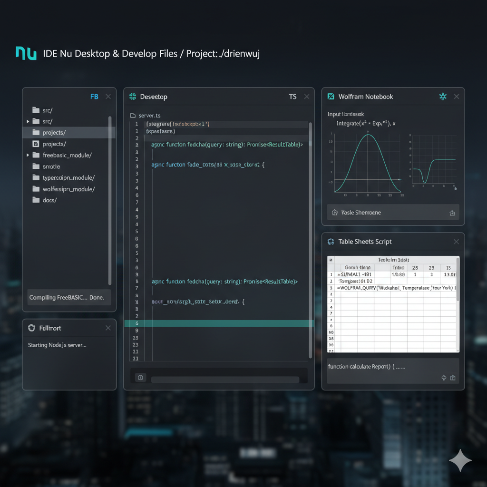

Here's a possible `README.md` for your project, incorporating the details you provided. I've also included an image that might represent the spirit of such a diverse development environment!



---

# Project drienwuj

## Overview

Welcome to `drienwuj`, a versatile desktop development environment designed to foster creativity and productivity across a multitude of programming paradigms. This IDE is built with an emphasis on flexibility, supporting development in FreeBASIC, TypeScript, and Wolfram Language, alongside robust features for spreadsheet scripting and general file management.

Our goal is to provide a seamless and integrated experience for developers working on projects that span scientific computing, web development, and low-level system programming, all from a unified desktop interface.

## Features

*   **Integrated Development Environment (IDE):** A custom-built desktop application offering a rich environment for coding, debugging, and project management.
*   **Multi-Language Support:**
    *   **FreeBASIC:** Fully integrated support for compiling and running FreeBASIC applications, perfect for high-performance desktop tools and game development.
    *   **TypeScript:** Comprehensive tooling for TypeScript, including intelligent code completion, real-time error checking, and seamless integration with Node.js and web development workflows.
    *   **Wolfram Language:** Built-in capabilities for developing and executing Wolfram Language scripts, ideal for symbolic computation, data analysis, and advanced visualizations.
*   **Table Sheets Scripting:** Powerful features for creating, manipulating, and scripting data within spreadsheet-like interfaces, enabling advanced data processing and reporting.
*   **File Management:** Intuitive tools for organizing, accessing, and managing all your project files and assets.
*   **Customizable Interface:** A clean, modern UI designed for efficiency, with options for personalization to suit your workflow.

## Getting Started

*(This section would typically include installation instructions, prerequisites, and a quick-start guide. Since this is a conceptual project description, I'll keep it general.)*

To get started with `drienwuj`, you would typically:

1.  Download and install the latest release of the IDE for your operating system.
2.  Ensure you have the necessary compilers/runtimes installed for FreeBASIC, Node.js (for TypeScript), and Wolfram Mathematica/Engine (for Wolfram Language) if they are not bundled.
3.  Launch the IDE and begin creating your projects!

## Directory Structure

```
./drienwuj/
├── src/                      # Source code for the IDE itself
│   ├── freebasic_module/     # Components related to FreeBASIC integration
│   ├── typescript_module/    # Components related to TypeScript integration
│   ├── wolfram_module/       # Components related to Wolfram Language integration
│   └── ui/                   # User interface components
├── projects/                 # Default directory for user projects
│   ├── my_freebasic_app/
│   ├── my_typescript_web_app/
│   └── scientific_wolfram_notebook/
├── docs/                     # Documentation and guides
├── scripts/                  # Helper scripts for development/build
└── README.md                 # This file
```

## Contributing

We welcome contributions to `drienwuj`! If you're interested in improving this versatile development environment, please refer to our `CONTRIBUTING.md` (to be created) for guidelines on how to submit bug reports, feature requests, and pull requests.

## License

This project is licensed under the MIT License - see the `LICENSE` file for details.

---

Here's an image visualizing a sophisticated, multi-language desktop IDE environment, blending elements of code, data, and scientific computation.

